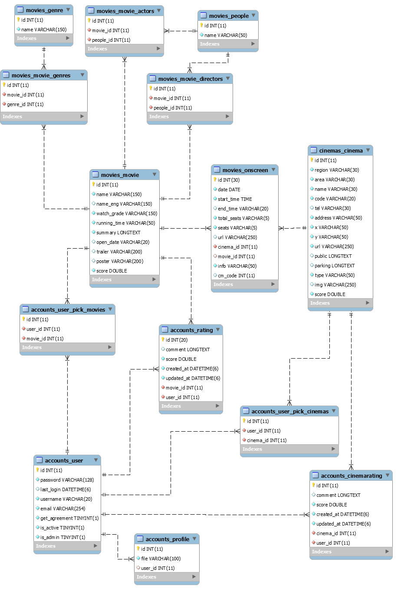
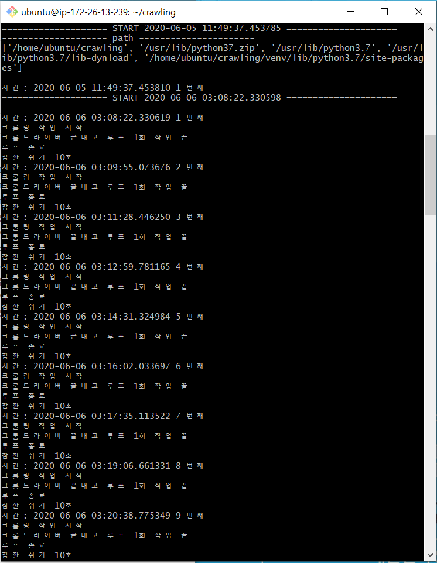

# Back end

- [우주씨 API 서버 바로가기](https://k02a4061.p.ssafy.io)

- 목차

  ```
  1. Database
  	- ERD
  	- Crawling
  2. Bigdata
  	- 추천시스템
  	- 테스트 코드
  3. API Server
  	- Rest API
  	- 배포
  ```

  


## 1. Database

### 1. ERD



### 2. 크롤링

- 정리 문서: [크롤링](./크롤링/Data_Crawling.md)

- 적용 방법

  - AWS EC2 에서 nuhup 을 통해 백그라운드로 실행합니다.

  - 실행 코드는 wouldyouci_database 폴더의 crawling_aws 폴더 하의 코드입니다.

    - AWS 환경에서 셀레니움을 작동시키기 위해 가상 브라우저 `pyvirtualdisplay`를 설치해야 합니다.

    ```
    nohup /home/ubuntu/crawling/venv/bin/python3.7 -u seat_crawling.py &
    
    tail -f crawling/nohup.out
    
    ```




## 2. Big Data

### 📕 추천 시스템

- 정리 문서: [추천_시스템](./추천알고리즘/추천_시스템.md)

  ```
  - Table of Contents
  - 추천 시스템이란
    - 정보 필터링
    - 추천 시스템
  - 추천 알고리즘 종류
    - 지식기반 필터링 (Knowledge-Based Filtering)
    - 내용기반 필터링 (Content-Based Filtering) 
    - 협업 필터링 (Collaborative Filtering)
  - 영화장르 필터링 구현
  - 회귀모형
  - KNN 알고리즘
  ```


### 🎁 Test Code

- `wouldyouci_database/recommendation/` 폴더의 파일을 통해 테스트 할 수 있습니다.

  - `requirements.txt` 를 통해 라이브러리를 설치합니다.
- `.env` 파일을 폴더 상단에 생성합니다. 키 값은 개발자에게 문의해주세요.
  
- 파일 설명

  - get_train_data.py

    - 학습시킨 내용을 피클파일로 저장합니다.

    - 총 약 15분의 시간이 소요됩니다.

      ```
      - genre_train.p
      - movie_train.p
      - movie_director_train.p
      - KNN.p
      ```

  - user_based_filtering.py

    - 훈련된 각 피클 파일을 사용하는 예측 모델끼리 비교할 수 있습니다.

    - 피클 파일을 불러오는 시간, 실행 결과를 아래와 같이 보여줍니다.

      ```
      Time to read pickle file 1:  0.34906625747680664
      Time to read pickle file 2:  1.4560999870300293
      Time to read pickle file 3:  0.36798691749572754
      
      ======== 전체영화 예상평점 - 장르 ===========
      START TIME :   22:18:01
      END TIME :   22:18:02
      TOTAL TIME :  1.266329288482666
      PREDICTED SCORE :  4.8
      
      ======== 전체 영화 예상평점 - 장르 & 감독 & 배우 ===========
      START TIME :   22:18:02
      END TIME :   22:18:04
      TOTAL TIME :  2.4890267848968506
      PREDICTED SCORE :  4.921303928582538
      
      ======== 특정 영화 예상평점 - 장르 & 감독 & 배우 ===========
      START TIME :   22:18:04
      END TIME :   22:18:05
      TOTAL TIME :  0.7290492057800293
      PREDICTED SCORE :  4.896391889549998
      
      ======== 전체 영화 예상평점 - 장르 & 감독 ===========
      START TIME :   22:18:05
      END TIME :   22:18:06
      TOTAL TIME :  0.8357305526733398
      PREDICTED SCORE :  4.9126213592233015
      ```

  - contents_based_filtering.py

    - KNN 모델을 실행시킨 결과를 확인할 수 있습니다.

      ```
      영화 id 목록 : [ 10068  10006  57095 137696 135874 129095 152168 151728 187940 171465
       164173 189111 189001 193804 181710 188790 153687 190720 189000 173260
       189028 187507]
      ```

      


## 3. API Server

### 📕 REST API

- 정리 문서: [REST API](./API서버/rest_api.md)

- 노션에 API Documents 를 작성, 프론트 팁과 협업하였습니다.
- 수정, 확인 등을 표시하며 상호작용할 수 있었습니다.


### 📔 배포

- 정리 문서: [https 배포하기](./API서버/https_배포하기.md)

- 도메인을 구입하고 AWS EC2 에서 https 로 배포하는 과정을 정리합니다. 