# 추천 시스템


### Table of Contents

- 추천 시스템

  - [Table of Contents](#table-of-contents)
  
  - [추천 시스템이란](#추천-시스템이란)
  
    - 정보 필터링
  
    - 추천 시스템
  
  - [추천 알고리즘 종류](#추천-알고리즘-종류)
  
    - 지식기반 필터링 (Knowledge-Based Filtering)

    - 내용기반 필터링 (Content-Based Filtering) 
    - 협업 필터링 (Collaborative Filtering)
  
  - [영화장르 필터링 구현](#영화장르-필터링-구현)
  
  - [회귀모형](#회귀모형)
  
  - [KNN 알고리즘](#knn-알고리즘)
  
    

## 추천 시스템이란


### 정보 필터링

- **정보의 양이 폭증함**에 따라 정보 소비자가 '원하는' 정보를 얻는데 **시간**과 **노력**이 많이 필요
- 정보 소비자에게 원하는 정보를 쉽게 얻도록 도와주는 분야
- 정보 필터링의 대표적인 분야
  - 검색
  - **추천 시스템**

### 추천 시스템

- 정보 소비자가 "원하는" 정보를 찾아 소비자에게 추천하는 시스템
- 검색과의 차이점
  - 검색은 소비자가 관심사를 표현하는 "검색"이라는 행위를 해야함 (active)
  - 추천은 특별한 행위 없이도 정보 전달이 가능 (passive)


## 추천 알고리즘 종류

### 1) 지식기반 필터링 (Knowledge-Based Filtering)

### 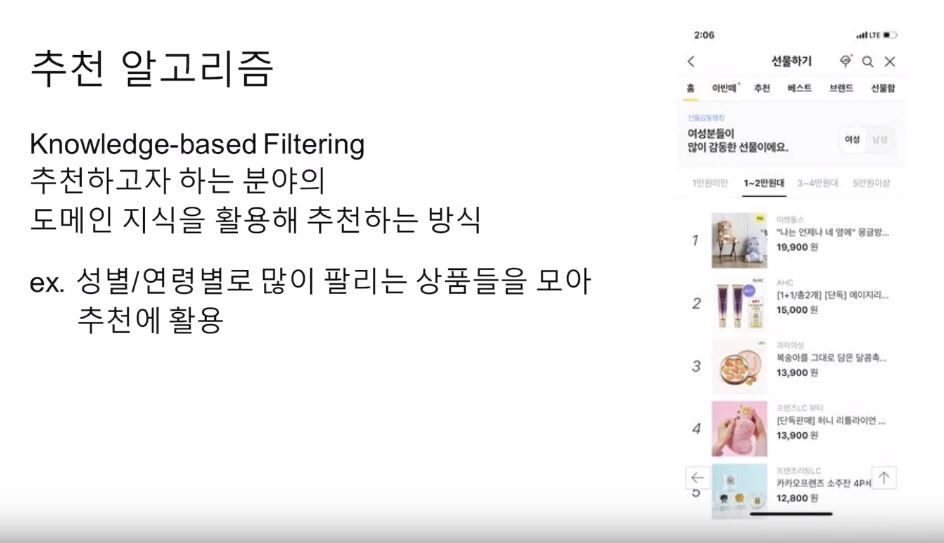

- 특정 분야에 대한 전문가의 도움을 받아서 그 분야에 대한 전체적인 지식구조를 만들고 이를 활용하는 방식

- 사람의 기본 정보가 추천에는 크게 도움이 되지 않는다는게 업계의 정설

  

### 2) 내용기반 필터링 (Content-Based Filtering)

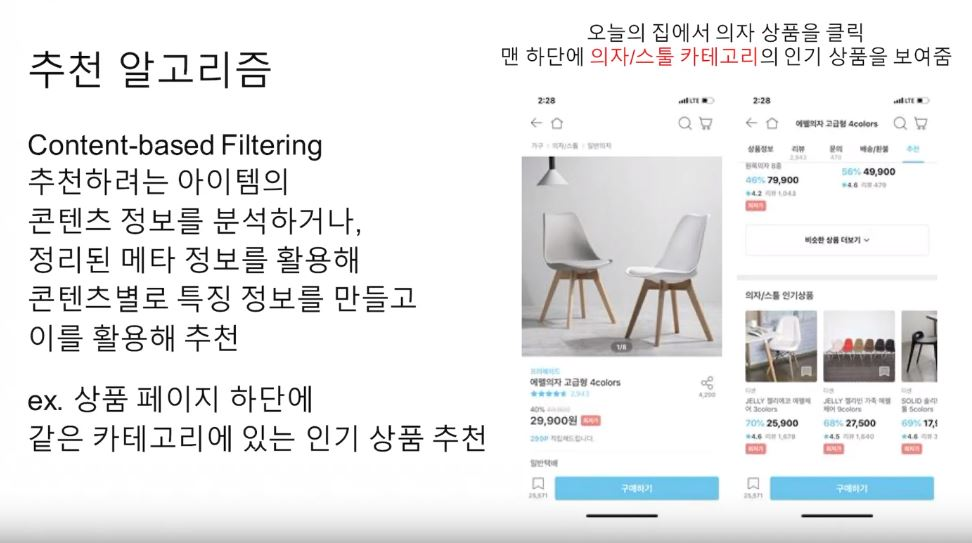


### 3) 협업 필터링 (Collaborative Filtering)

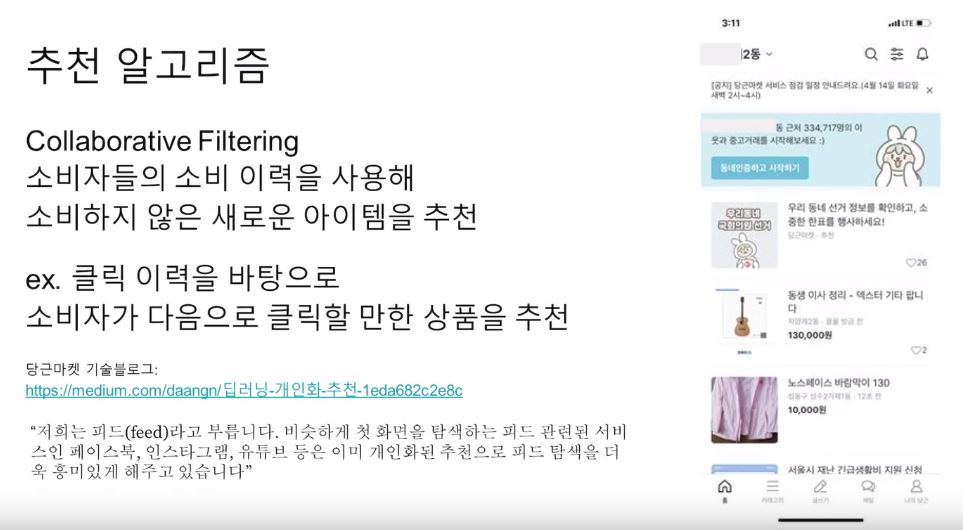

- 구매/소비 패턴이 비슷한 사용자를 한 집단으로 보고 그 집단에 속한 소비자들의 취향을 추천하는 방식


## 영화장르 필터링 구현

- 내용기반 필터링 (Content-Based Filtering)
- 실제 개발은 장르 + 감독으로 추천하는 서비스를 만들었지만 이해를 돕기 위해 장르 데이터로 필터링을 했음


#### ERD 다이어그램

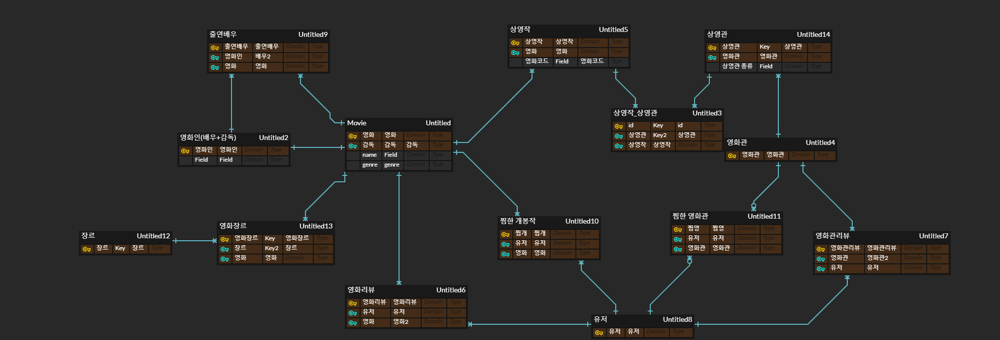


### Install

```
pip install numpy
pip install pandas
pip install scikit-learn
pip install matplotlib
pip install seaborn
```


### Import

```
import pandas as pd
import numpy as np

from sklearn.model_selection import train_test_split
from sklearn.linear_model import LinearRegression
from sklearn.linear_model import Lasso
from sklearn.metrics import mean_squared_error

import matplotlib.pyplot as plt
import seaborn as sns

from sklearn.model_selection import RandomizedSearchCV
from scipy.stats import uniform as sp_rand
```


### Read Data

```
ratings = pd.read_csv('./data/wouldyouci/ratings.csv')
genres = pd.read_csv('./data/wouldyouci/genres.csv', index_col='id')

# id컬럼 drop
movie_genres = pd.read_csv('./data/wouldyouci/movie_genre.csv',index_col='movie_id')
movie_genres = movie_genres.drop('id',axis='columns')
```

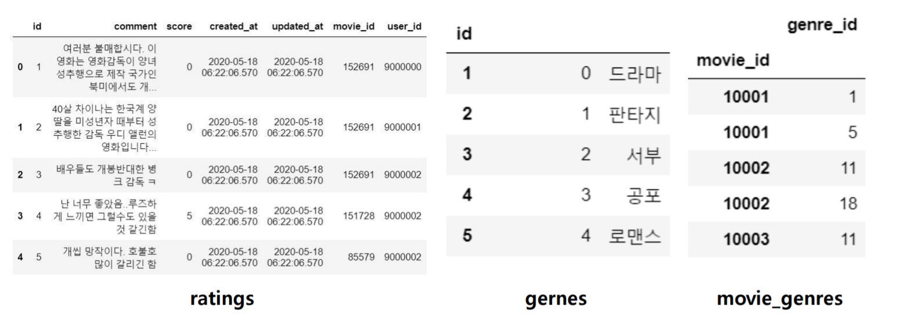

### 장르 분석

```
movie_genres['genre_id'] = movie_genres['genre_id'].apply(lambda x: genres.loc[x, 'name']+"|")
movie_genres = movie_genres.rename(columns={'genre_id' :'genre'})

# 장르들을 이어붙임
movie_genres = movie_genres.groupby('movie_id').sum()
```

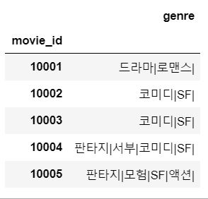


### 장르 데이터 숫자형으로 변환하기

```
genres_dummies = movie_genres['genre'].str.get_dummies(sep='|')
```

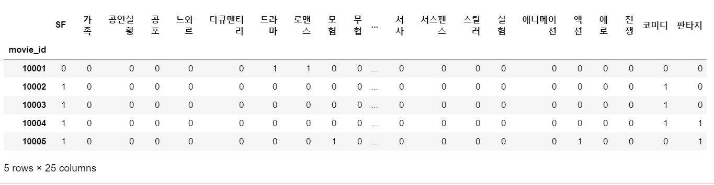


### Pickle 파일로 만들기

```
path = os.path.join(BASE_DIR, 'genres_train.p')
genres_dummies.to_pickle(path)
```


### 영화평점 예측하기

```
# uesr_id = 9001839
tester = ratings[ratings['user_id'] == 9001839]
```

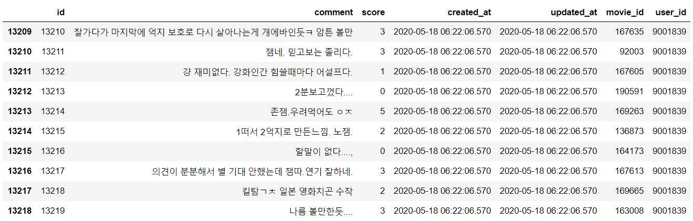


```
# 위에 저장했던 pickle 파일을 읽어와서 merge 시켜줌
genres = pd.read_pickle('./genre_train.p')
tester = tester.merge(genres, left_on='movie_id', right_index=True)
```

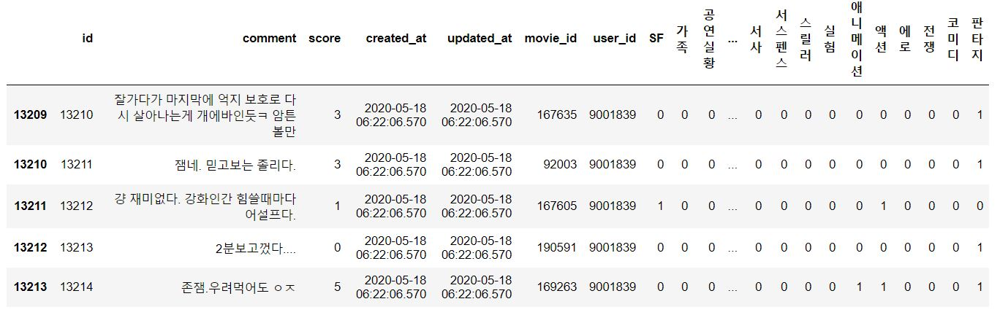

#### 유저가 평가한 리뷰의 장르 분포

```
tester[genres.columns].sum().sort_values(ascending=False)
```

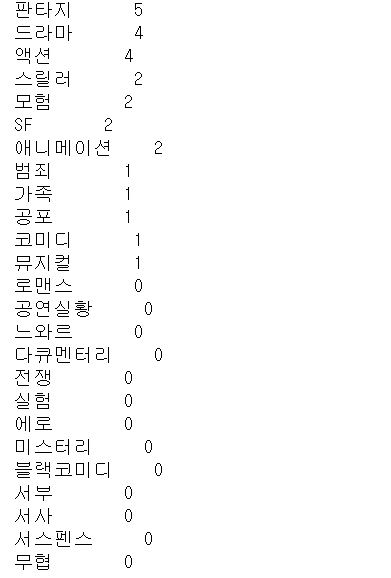


```
x_train, x_test, y_train, y_test = train_test_split(tester[genres.columns], 
                                                    tester['score'],
                                                    random_state=406,
                                                    test_size=.1)
```

- 전체 데이터를 학습을 위한 데이터, 평가를 위한 데이터로 나누어 측정
- x축: 장르,  y축 : 리뷰평점
- test_size를 0.1로 해두면 train : test 데이터 분포가 9:1로 설정됨


## 회귀모형

### 선형회귀(LinearRegression)

```
reg = LinearRegression()

# 학습
reg.fit(x_train,y_train)

intercept = reg.intercept_
coef = reg.coef_

# 유저 프로필
uesr_profile = pd.DataFrame([intercept, *coef], index=['intercept', *genres.columns], columns=['score'])
```

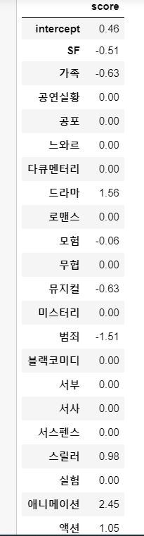

#### 그래프로 보기

```
%matplotlib inline

# 한글 깨져서 설정
plt.rcParams['font.family'] = 'Malgun Gothic'

plt.figure(figsize=(25,7))
sns.barplot(data=uesr_profile.reset_index(), x='index', y='score')
```

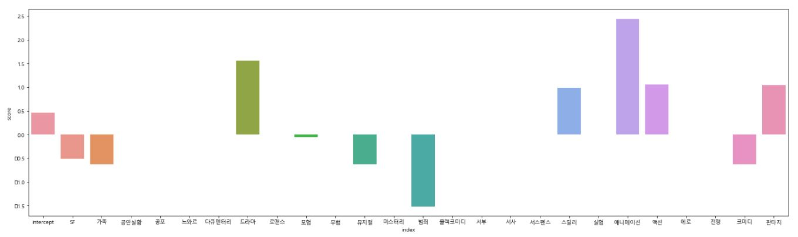

애니메이션과 드라마에 좋은 점수를 주는 것을 알 수 있음


#### RMSE(Root Mean Square Error) 구하기

```
predict = reg.predict(x_test)
mse = mean_squared_error(y_test,predict)
rmse = np.sqrt(mse)

# 낮을수록 좋음
# rmse = 0.5569105691056957
```


### 문제는?

- 데이터 갯수가 작은 user에게 coefficient 계산이 정확하지 않음, 또는 테스트 데이터만 설명할 수 있음 ( [오버피팅](https://elitedatascience.com/overfitting-in-machine-learning#how-to-prevent))
- [정규화(regularization)를 통한 과적합(Overfitting) 방지](https://m.blog.naver.com/PostView.nhn?blogId=wndrlf2003&logNo=221582704317&proxyReferer=https:%2F%2Fwww.google.com%2F)


### Lasso(제 1정규화)

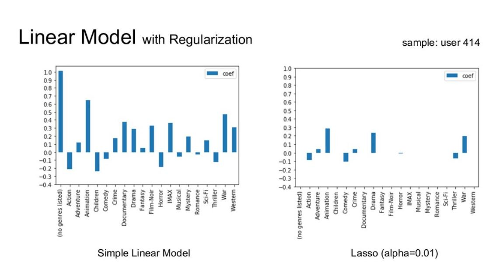

- coefficient 계수들의 크기가 줄어듬
-  쓸모 있는 변수들은 남기고 그렇지 않은 변수들을 제거하는게 탁월함(feature selection)
- Lasso 모델은 feature selection이 자동으로 됨


```
reg = Lasso(alpha=0.05)

reg.fit(x_train,y_train)

intercept = reg.intercept_
coef = reg.coef_

uesr_profile = pd.DataFrame([intercept, *coef], index=['intercept', *genres.columns], columns=['score'])
```

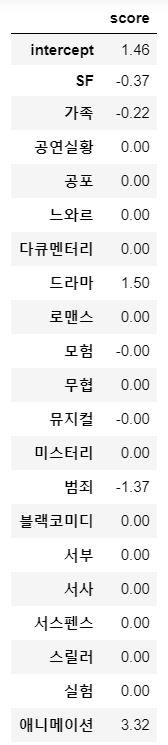


#### 그래프로 보기

```
plt.figure(figsize=(25,7))
sns.barplot(data=uesr_profile.reset_index(), x='index', y='score')
```

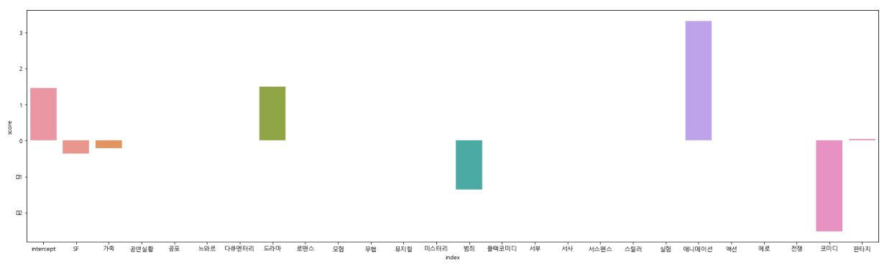

정규화 전보다 변수들이 많이 제거됨(feature selection)


#### RMSE(Root Mean Square Error)

```
predict = reg.predict(x_test)
mse = mean_squared_error(y_test,predict)
rmse = np.sqrt(mse)

# rmse = 0.5894064136626995
```


### 하이퍼 파라미터 튜닝

- [**Hyperparameter Optimization**](http://research.sualab.com/introduction/practice/2019/02/19/bayesian-optimization-overview-1.html)

- Lasso의 적절한 alpha을 구해주는 방법

```
model = Lasso()
param_grid = {'alpha' : sp_rand()}

# 150번 돌려봄
research = RandomizedSearchCV(estimator=model, 
                   param_distributions=param_grid, 
                   n_iter=150, 
                   cv=10, 
                   random_state=10 )


research.fit(tester[genres.columns], tester['score'])

# research.best_estimator_.alpha = 0.771320643266746
```

- RandomizedSearch 결과 : research.best_estimator_.alpha
- 최적의 alpha값 : 0.771320643266746


```
intercept = research.best_estimator_.intercept_
coef = research.best_estimator_.coef_

uesr_profile = pd.DataFrame([intercept, *coef], index=['intercept', *genres.columns], columns=['score'])
```

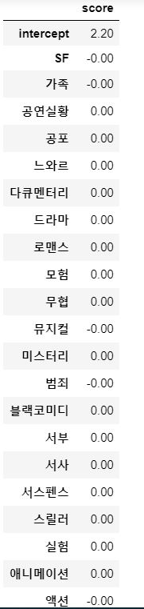


## KNN 알고리즘


### Install

```
pip install pandas
pip install numpy
pip install scipy
pip install surprise
```


### Import

```
import pandas as pd
import numpy as np
import scipy as sp
import surprise
```


### Read Data

```
data = pd.read_csv('./data/wouldyouci/ratings.csv')
```

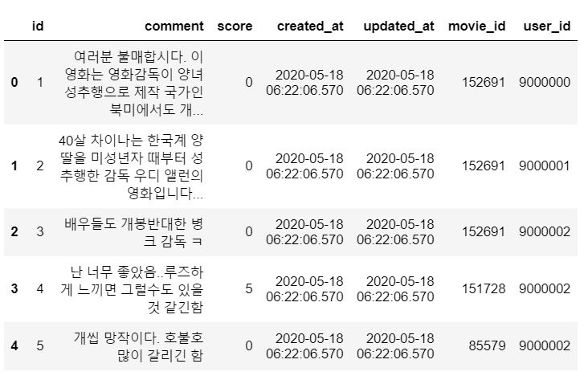


#### 1. Collaborative Filtering 추천 시스템에 필요한 변수만 선택

```
df = data[['user_id', 'movie_id', 'score']]
```

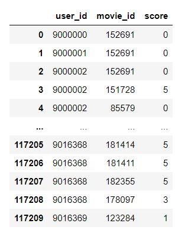


#### 2. 데이터 변형(테이블 -> 딕셔너리)

```
# 테이블을 딕셔너리로 만드는 함수
def recur_dictify(frame):
    if len(frame.columns) == 1:
        if frame.values.size == 1: return frame.values[0][0]
        return frame.values.squeeze()
    grouped = frame.groupby(frame.columns[0])
    d = {k: recur_dictify(g.iloc[:, 1:]) for k, g in grouped}
    return d
```

- 보유한 데이터가 테이블 형태로 되어있는데, 추천시스템에 사용하기 위해서는 데이터를 딕셔너리 형태로 바꾸어 주어야 한다. 그래야 머신러닝 모델을 통해 나온 결과를 인덱싱해서 추천 영화 리스트로 뽑아낼 수 있다.


#### 3. 최소개수 지정

```
n1 = 5
filter_movies = df['movie_id'].value_counts() >= n1
filter_movies = filter_movies[filter_movies].index.tolist()

n2 = 5
filter_users = df['user_id'].value_counts() >= n2
filter_users = filter_users[filter_users].index.tolist()

df_new = df[df['movie_id'].isin(filter_movies) & df['user_id'].isin(filter_users)]

# 테이블 -> 딕셔너리
df_to_dict = recur_dictify(df_new)
```


#### 4. 사용자 목록, 영화 목록을 리스트로 담기

```
user_list = []
movie_set = set()

for user in df_to_dict:
    user_list.append(user)

    for movie in df_to_dict[user]:
        movie_set.add(movie)

movie_list = list(movie_set)
```


#### 5. 추천 시스템에 사용할 rating 딕셔너리 만들기

```
# 학습할 데이터를 준비한다.
rating_dic = {
        'user_id': [],
        'movie_id': [],
        'score': []
    }
```

```
# 유저 수 만큼 반복
for user in df_to_dict:
	# 해당 유저의 리뷰 수 만큼 반복
    for movie in df_to_dict[user]:
        u_index = user_list.index(user)
        m_index = movie_list.index(movie)
        score = df_to_dict[user][movie]

        rating_dic['user_id'].append(u_index)
        rating_dic['movie_id'].append(m_index)
        rating_dic['score'].append(score)
        
# 데이터셋 만들기
df = pd.DataFrame(rating_dic)
```

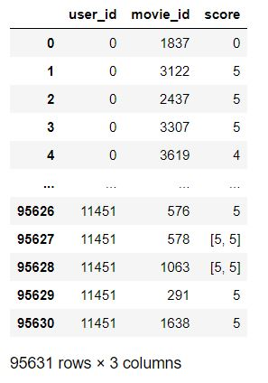

#### 6. 학습 : surprise.KNNBasic

```
# 데이터를 읽어들이는 객체 생성 (rating scales : 평점 범위)
reader = surprise.Reader(rating_scale=(0.5, 5.0))

col_list = ['user_id', 'movie_id', 'score']
data = surprise.Dataset.load_from_df(df_new[col_list], reader)

# 학습
trainset = data.build_full_trainset()

algo = surprise.KNNBasic(sim_options=option)
algo.fit(trainset)
```

- 사용자간 유사도를 측정하는데에는 [pearson similarity](https://ko.wikipedia.org/wiki/%ED%94%BC%EC%96%B4%EC%8A%A8_%EC%83%81%EA%B4%80_%EA%B3%84%EC%88%98)를 사용


#### 7. 예측 : KNN(K-Nearest Neighbor) 알고리즘

```
# user_id = 9000002
index = user_list.index(9000002)
result = algo.get_neighbors(index, k=5)
```

- user_id가 9000002인 유저의 이웃 K명을 구함
- result = [828, 904, 1187, 1386, 1416]


#### 8. Pickle 파일로 저장

```
recommand_dic = {
        'user_id': [],
        'movie_id': [],
    }

for user_key in df_new['user_id'].unique():
    index = user_list.index(user_key)
    result = algo.get_neighbors(index, k=5)
    recom_set = set()
    for i in result:
            max_rating = data.df[data.df['user_id'] == user_list[i]]['score'].max()
            recom_movies = data.df[(data.df['score'] == max_rating) & (data.df['user_id'] == user_list[i])][
                'movie_id'].values
            for item in recom_movies:
                recom_set.add(item)

            for item in recom_set:
                recommand_dic['user_id'].append(user_key)
                recommand_dic['movie_id'].append(item)

pickle = pd.DataFrame(recommand_dic)

BASE_DIR = os.path.dirname(os.path.abspath(__file__))
path = os.path.join(BASE_DIR, 'KNN.p')

pd.to_pickle(pickle, path)
```

- K=5로 설정되어서 유사한 유저 5명을 기반으로 영화를 추천해주게 된다.
- 유사한 유저들이 가장 높은 점수를 준 영화 목록을 set에 넣는다
- 해당 유저에게 추천하는 영화 리스트를 Pickle 파일로 저장

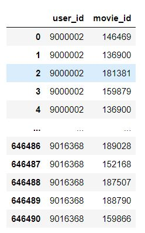

#### 9. Pickle 파일에서 바로 꺼내쓰기(user_id = 9000002)

```
user_id = 9000002
path = os.path.join(settings.BASE_DIR, 'utils', 'KNN.p')
df = pd.read_pickle(path)
movie_list = df.loc[df['user_id'] == user_id, 'movie_id'].unique()
```

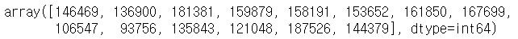