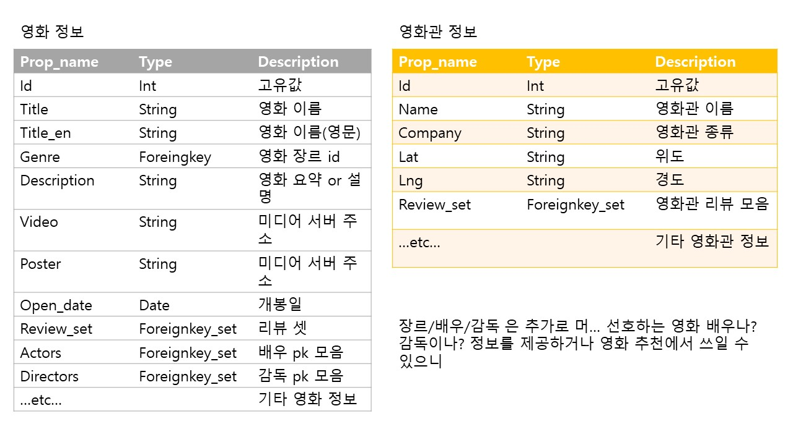
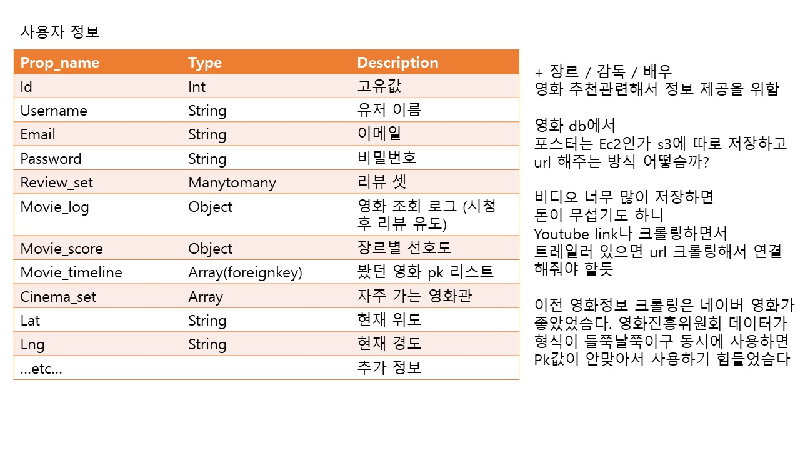

# 크롤링(참고자료) & Data구축..

1. Crontab을 이용하여 shell 스크립트를 주기적으로 실행

[파이썬으로 웹페이지 크롤링을 해보자. (2) 텔레그램으로 메시지 보내기](https://softwaree.tistory.com/75)

   >> 로컬 실행으로 백쪽의 데이터를 변경해줘야 할 듯!

2. Selenium & Django

[나만의 웹 크롤러 만들기(3): Selenium으로 무적 크롤러 만들기](https://beomi.github.io/2017/02/27/HowToMakeWebCrawler-With-Selenium/)

  >> 셀레니움 관련 설명을 간단하게 해놓음 (예전 프로젝트 당시 참고했던 자료)

3. Elasticsearch + pandas

[실시간으로 뉴스를 크롤링하여 뉴스 검색엔진 API 만들기](https://buttercoconut.xyz/209/)

  >> 이건 혹시나 해서... 데이터 저장하는 형식에 참고

4. 내가 생각하는 DB..

 >> AWS 유료 서비스 안해준다고 하니 포스터 URL을 저장하던가 ... 장고 미디어에 저장할 수 있음 저장하던가 해야할듯..?

>> URL로 하나하나 가져오면 너무 느릴까봐 걱정쓰

# 영화 데이터

- 관람 등급
- 상영시간
- 예고편 url
- 별점 리뷰와 연결할 id 값 연구

1. 데이터를 어디서 가져올까요

   1. 영화

      - [Kmdb](https://www.kmdb.or.kr/main)
      - [영화관입장권통합전산망 API](https://www.kobis.or.kr/kobisopenapi/homepg/main/main.do)
      - [Movist](http://www.movist.com/)
      - [네이버 검색 영화 API](https://developers.naver.com/docs/search/movie/)
      - [다음 영화](https://movie.daum.net/main/new#slide-1-0)
      - [네이버 영화](https://movie.naver.com/)
      - [IMdb](https://www.imdb.com/?ref_=nv_home) : 해외 사이트인데 영진위API 보다 낫다 이말임...
      - [~~아마존 리뷰 관련](https://snap.stanford.edu/data/web-Movies.html) - 1997년 ~ 2012년 10월까지의 리뷰 뿐인덧...~~
      - 아래의 내용은 코치님 특화플젝 당시 영화 자료 얻었던 자료입네다 (그냥 영화데이터)
        - https://grouplens.org/datasets/movielens/latest/
        - https://www.imdb.com/interfaces/
        - imbd랑 movielens랑 id값이 달라 두개 비교해놓은 파일이 movielens에 있다고함

   2. 영화관

      - [메가박스](https://www.megabox.co.kr/theater/list)

        [Mega Box](https://www.notion.so/Mega-Box-6f3811f70eeb4414ba8f1077a524677e)

      - [CGV](http://www.cgv.co.kr/theaters/)

        [CGV](https://www.notion.so/CGV-de3efd9cb6294d5f977a7ad6840e2086)

      - [롯데시네마](https://www.lottecinema.co.kr/NLCHS#)

        [Lotte Cinema](https://www.notion.so/Lotte-Cinema-6f200d9d74ee4860bee22be9eeb69459)

      - [영화관입장권통합전산망 Kobis 영화 상영관 정보](http://www.kobis.or.kr/kobis/business/mast/thea/findTheaterInfoList.do)

        - 스크린수, 좌석수 제공
        - 대표 3사 말고 모든 영화관 정보 제공
        - 대표 3사 + 기타로 구분하거나?
        - 예매 페이지 링크를 영화관별로 연결해놓아야 - 소규모 영화관들 때매 특히 잘
        - 영화관별 상영 정보는 이거 셀레니움으로 이캐저캐 하면 될 것 같기도 하네

   참고 사이트

   - Yes24 영화
     - 모든 영화관 정보 제공
     - 메가박스만 좌석수 정보 제공하고 있음
     - 우리 앱은 ㄹㅇ 위치 기반 지도로 비교해서 보여준다를 차별성, 특장점으로 내세워야...
   - 맥스무비
     - 대표 3사 영화관 외의 영화관들 예매 할 수 있는 사이트 인 듯?
   - 인터파크 영화
     - 사이트 구리다..
   - 실시간 위치 기반이 주가 된다면 추가구현 할 수 있는 일이 무엇이 있을까..

