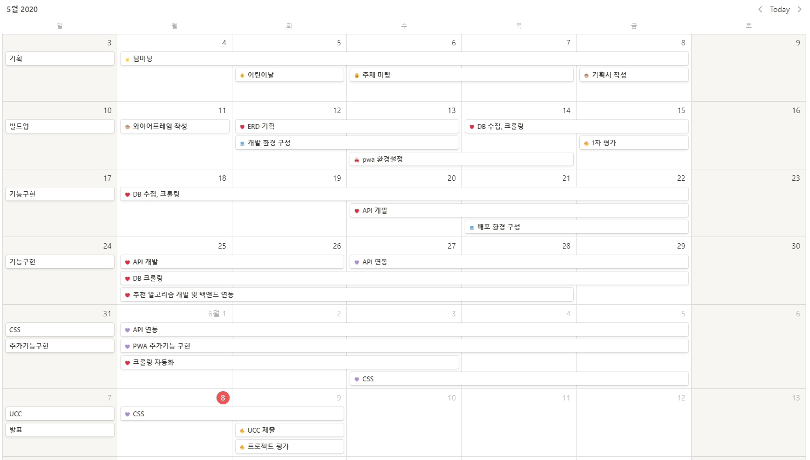
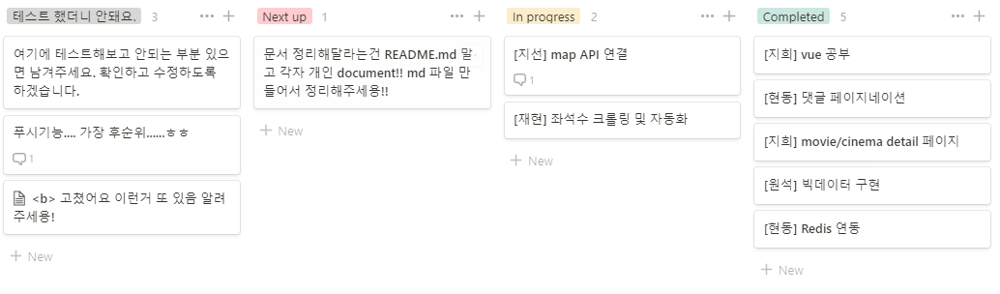
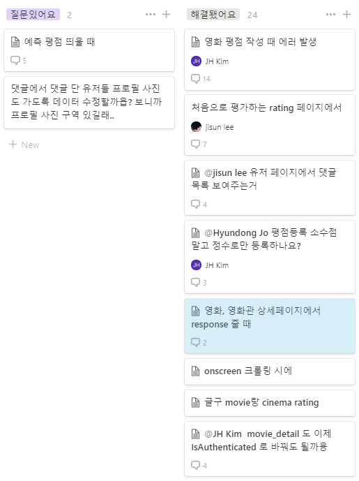

### 코드 관리: Gitlab

#### 1. Git-flow


1. branch
   - master 
   - develop
   - front
   - back
   - feature 
     - 개별 기능 구현
     - ex) `feature/rest-api`


2. How to push and merge?

   **1. 새로운 branch 를 만들어서 작업하는 경우**

   1. local front 에서 origin front pull 받고 로컬의 상태와 원격의 상태를 일치 시킨다.
      1. -set—upstream 을 해 놓고 git pull origin front 보다는 git pull 만 쳐도 되도록 설정 한다.
   2. feature/test 를 만들고 작업한다, push 한다.
   3. 원격에서 feature를 front로 머지한다. 머지 했음을 다른 사람한테도 알려준다.
      1. 다른 사람은 같은 파일에서 작업중이었다면, 일부 코드만 가져와서 합치는 fetch 가 있고 컨플릭을 최소화 할 수 있긴 한데... 그냥 컨플릭을 해결하는 편이 나을수도.. ㅠ
      2. [여기](https://backlog.com/git-tutorial/kr/stepup/stepup3_2.html) 참고
   4. 로컬에서 front로 checkout
   5. 다시 1번으로 돌아가서 작업 시작

   

   **2. 쓰던 branch 계속 쓰고 싶은 경우**

   ​	(1, 2, 3, 4번 동일)

   1. local front 에서 origin front pull 받고 로컬의 상태와 원격의 상태를 일치 시킨다.

   2. git checkout feature/test  (head 확인)

   3. git merge front

   4. 다시 작업 시작

      

   **3. 중요한 것은**

   1. front, back로의 화살표 그래프 방향은 일방적이어야 한다~~ 주로, 대부분의 경우, merge 를 받기만 해야한다~~ 특히 develop은!!

   2. 다른 사람과 같이 확인해야 할 branch에 merge 시 원격 Merge Request 를 하자 (front, back, dev)

   3. Head 의 위치를 확인하자. 다른 사람들이 어디에 merge 하는지, 어디 코드를 우리가 main 으로 관리하고 있는지를 염두하자. feature 는 생겼다가 삭제했다가 난리가 나도 되는데 front, back, develop 의 코드는 상단에 두고 소중하게 관리하자

   4. 여차하면 reset 하면 된다~~ 커밋 내역이 있으면 언제든 돌아갈 수 있다~~~ 하지만 front, back, dev의 것은 함부로 하지말자... 문제 발생시 같이 꼭 이야기 하고 상황을 공유하자..

   5. 어디서 시작하고 머지시킨건지는 그래프 모양을 참고합시다.

      


3. 기타 

   - Master, Develop, Front, Back 은 Push X, 오직 MR

   - `--set-upstream origin [branch name]` 설정을 되도록이면 각 브랜치에 모두 해줍시다. front/ back은 필수
   - 같은 파일 동시 작업시 다른 팀원에게 알려주기
   - 공통으로 쓰는 파일 업데이트 시 (.gitignore 등) 알려주기

   - django 의 경우 requirements.txt, vue 의 경우 package.json 파일 업데이트는 한 사람이 맡아서 하기

   - env 환경 설정해서 프로젝트 환경 뒤섞이는 일 없게 하기

   


#### 2. Commit Message

1. Convention

   - message 
- 대문자로 시작
     - 자주 쓰는 기본 메시지의 경우
       - Mod : modify, 코드 수정 시
       - Add  : 새 파일 작성
       - Del : delete, 코드 및 파일 삭제
     - 기타
       - Refactor : 전면 수정
       - Resolve, Reset, Update 등등
- title & body
  
  - `...` 로 요약 된 커밋 메시지를 통해 titie 과 detail 을 구분하기
  
  - 커밋 메시지 기록 중 shift enter 키를 누르고 detail 을 입력합니다. 
  
      예시는 커밋 첫글자가 소문자로 되어있는데 요약된다는 부분 확인만 해주시구 대문자로 남깁니다.
  
     
     
     
     
     ```
      $ commit -m 'Message file.exe title
       [shift enter]
       > detail message (여기는 한글 or 영어)'
     ```
     
  - 이슈와 매칭하는 경우 하단에 기록
  
      ```
       Mod file.exe title
           
       see the issue for details
            
       Refs #133
      ```
  
      
  
  

### 일정 및 이슈 관리: Jira & Notion
#### 1. 프로젝트 일정

| 스프린트            | 일정                       | 목표                                         |
| ------------------- | -------------------------- | -------------------------------------------- |
| S02P31A4 스프린트 1 | 2주차: 5월 11일 ~ 5월 15일 | 기획서 작성 및 프로젝트 환경 구성, 자료 수집 |
| S02P31A4 스프린트 2 | 3주차~5주차                | 세부 기능 구현                               |
| S02P31A4 스프린트 2 | 6주차                      | 추가 기능 구현 및 디자인 수정                |
| S02P31A4 스프린트 3 | 6주차                      | 최종 테스트, 발표 준비 및 UCC 제작           |

 


#### 2. 하루 일정

1. 매일 아침 9시 반미팅 & 이후 팀 미팅 

2. 노션의 Backlog 에 스크럼에서 공유한 할 일, 하고 있는 일 작성 + 편집 

   1. 지라랑 별개입니다. 본인이 어떤 파일에서 어떤 기능을 구현중인지 작성해주세요. 원격에서 소통을 원활하게 하기 위한 방법이에요.

   

3. 개발

   1. 하다가 궁금한건 노션의 Backlog 에 질문, 이슈 남기기

      

   2. 커밋을 자주하자!! `git add . `을 지양하자

4. 매일 저녁 4시 반미팅 & 팀 미팅 

5. 퇴실 칼퇴 샤따 딱내려~


#### 3. 프로젝트 규칙

- MR 시에 코드 리뷰 해주기
  - 리퀘스트 보낸 사람은 MR 이후 merge 된 branch 삭제 하기
- 공지 채널에 올라오는 공지 글에는 읽었다는 확인 스티커를 달아주기
- 사소한 것은 없으니 늘 적극적으로 미팅 참여해주기


